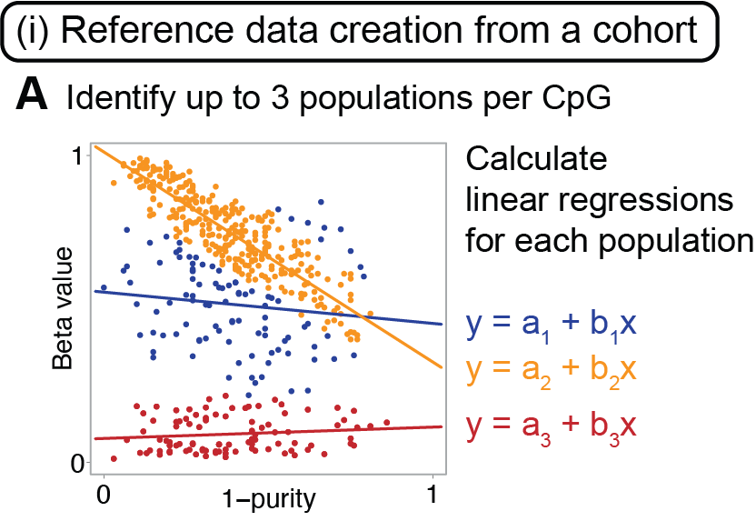
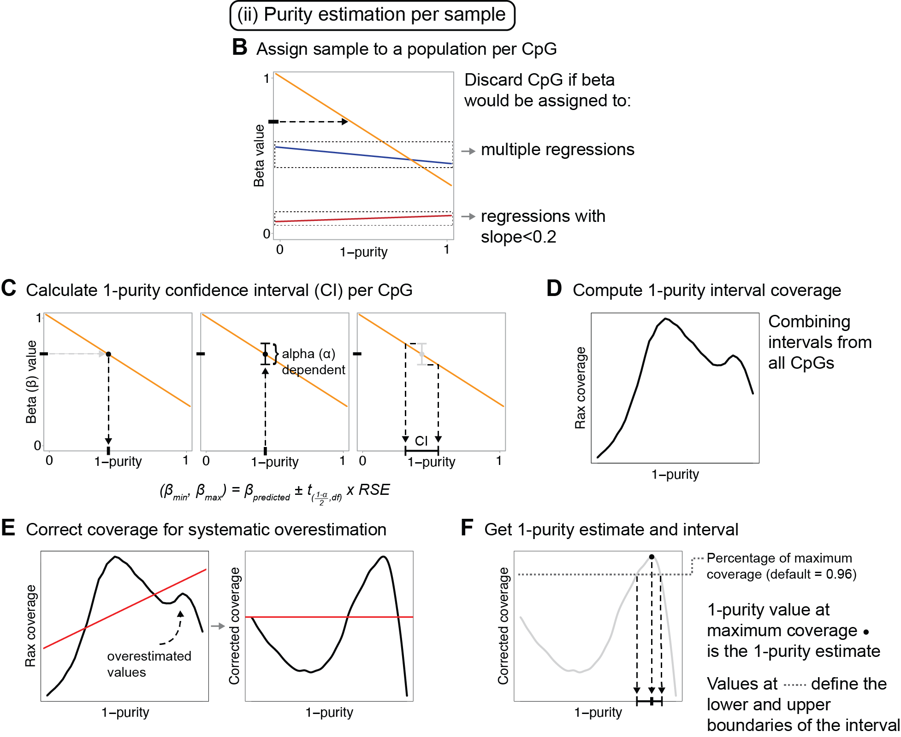
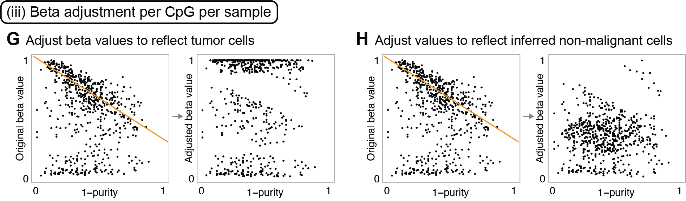

# PurEst
Method for calculating tumor purity and adjusting Illumina 450/850K DNA methylation beta values. This work has been described in the article "**Tumor purity estimated from bulk DNA methylation can be used for adjusting beta values of individual samples to better reflect tumor biology**" published by [Sasiain, Nacer et al. in *JOURNAL*](LINK).

## Framework
PurEst is divided into three main modules:

1. *Creation of reference data from a cohort*: in this first module, reference linear regressions are calculated based on DNA methylation beta values and tumor purity estimates of a cohort. Each regression represents a sample population as shown in the figure below. Scripts used in this module: ref_regression_calculator.r (main), new_function_correctBetas.r.



2. *Estimation of tumor purities for individual samples*: in this module, CpGs are filtered based on beta variance and then each CpG is processed individually per sample as shown in the figure below. Scripts used in this module: purity_estimator.r (main), predicting_purity.r, purity_coverage.r.



3. *Adjustment of beta values per CpG per sample*: in this final module, beta values are adjusted for tumor cells and inferred for normal cells using the reference regressions and the estimated purities. This can be carried out after refitting the regressions to include the new data points with estimated purities or using the original reference regressions. Scripts used in this module: final_beta_correction.r (main), new_function_correctBetas.r.



## How to use

All scripts must be in the same folder. They should be called from the terminal following the commands below.

* ref_regression_calculator.r
```bash
Rscript path_to_scripts_folder/ref_regression_calculator.r -c [NUM_OF_CORES] -b [INPUT_BETAS.rds] -p [INPUT_PURITIES.rds] -o [OUTPUT_PATH] -n [OUTPUT_NAME] -v [VARIANCE_THRESHOLD]
```
INPUT_BETAS.RData: beta values per sample should be previously saved in .rds format. The file should contain a matrix with Illumina CpG identifiers as row names and samples as column names.  
INPUT_PURITIES.RData: a named vector with same sample names, also saved in .rds format.

* purity_estimator.r
```bash
Rscript path_to_scripts_folder/purity_estimator.r -c [NUM_OF_CORES] -a [ALPHA_VALUE] -s [SLOPE_THRESHOLD] -p [PERCENTAGE_TO_INTERVAL] -d [REGRESSIONS_DIRECTORY] -b [BETAS_TO_ANALYSE] -o [OUTPUT_NAME] -l [OUTPUT_LOCATION]
```

* final_beta_correction.r
```bash
RScript path_to_scripts_folder/final_beta_correction.r -c [CORES] -r [refitting: TRUE/FALSE] -R [PATH_TO_REF_REGRESSIONS] -P [REF_COHORT_PURITY] -B [REF_COHORT_BETAS] -p [ESTIMATED_PURITIES] -b [BETAS_TO_CORRECT] -F [CORRECT_CERTAIN_CPGS: TRUE/FALSE] -f [CPGS_TO_CORRECT] -o [OUTPUT_PATH] -n [OUTPUT_NAME]
```

> NOTE: A more detailed explanation of how to use any script is available in each script's documentation at the top of the file, or by running the scripts with the -h flag.
```bash
RScript path_to_scripts_folder/final_beta_correction.r -h
```

## Reference data

Beta values, beta variance, reference regression information, and purity estimates for TCGA BRCA (n=630 samples), TCGA LUAD (n=418), and TCGA LUSC (n=333) are available in Zenodo through [this DOI](https://doi.org/10.5281/zenodo.10549397).

